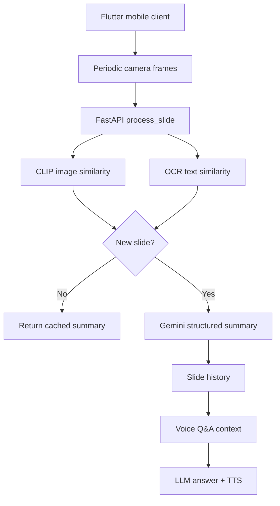

# SlideScribe Architecture Roadmap

This roadmap keeps improvements incremental so SlideScribe can grow from a hackathon demo into a production-style multimodal lecture assistant without rewriting the app at once.

## Current Architecture

## Increment 1: Lecture Memory Retrieval

Goal: answer questions using the most relevant slides from the lecture, not only the latest slide window.

Implementation idea:

- Store each slide summary with slide number, timestamp, OCR text, and detection metrics.
- Rank historical slides against the question using lexical similarity and token overlap.
- Build the LLM context from the top matching slides, while keeping recent slides as a fallback.
- Return matched slide numbers in the `/ask` response for debugging and UI explainability.

Why this matters:

- Supports questions such as "what did slide 2 say about attention?"
- Reduces irrelevant context passed to the model.
- Creates the foundation for a future vector-search RAG layer.

## Increment 2: Persistent Session Store

Goal: separate lecture/session state from process memory.

Implementation idea:

- Introduce a session ID for each capture session.
- Move slide history from local JSON files to Redis or SQLite.
- Store slide fingerprints, summaries, OCR text, and timestamps per session.
- Add cleanup/expiration for old sessions.

Why this matters:

- Makes the backend safer to restart.
- Enables multiple users/sessions.
- Prepares the app for deployment.

## Increment 3: Embedding-Based RAG

Goal: replace lexical retrieval with semantic retrieval.

Implementation idea:

- Generate an embedding for each slide from title, OCR text, summary, equations, code, and visual descriptions.
- Store embeddings in a vector index such as FAISS, pgvector, or Redis Vector Search.
- On each question, retrieve top-k relevant slides and pass only those into the answer model.

Why this matters:

- Handles paraphrased questions.
- Improves answers across long lectures.
- Aligns the project with LLM infrastructure and retrieval systems work.

## Increment 4: Cost and Latency Controls

Goal: make the AI pipeline measurable and cheaper to run.

Implementation idea:

- Cache Gemini summaries by slide fingerprint.
- Track OCR latency, CLIP latency, Gemini latency, answer latency, and estimated model cost per session.
- Add model fallback routing for summarization and Q&A.
- Use streaming or background workers for long model calls.

Why this matters:

- Shows production engineering maturity.
- Connects directly to LLM gateway, observability, and model-routing experience.

## Increment 5: Real-Time Delivery

Goal: make the frontend feel live under classroom conditions.

Implementation idea:

- Add WebSocket updates for slide summaries and voice answer status.
- Send partial status updates such as detecting, summarizing, answering, and speaking.
- Keep the REST API as a fallback path.

Why this matters:

- Better mobile UX.
- Cleaner separation between capture, backend processing, and UI state.
